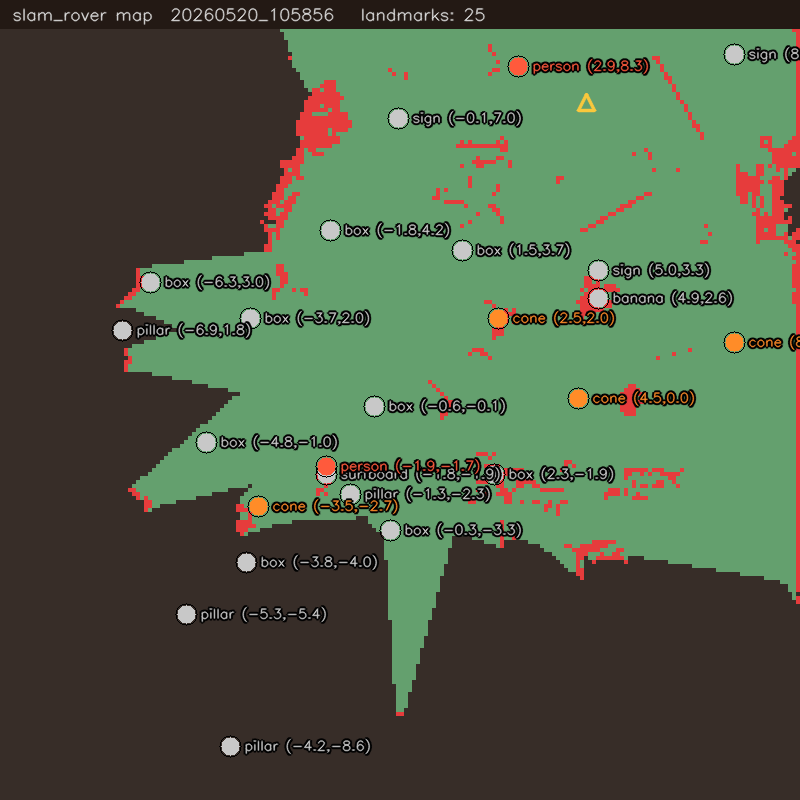
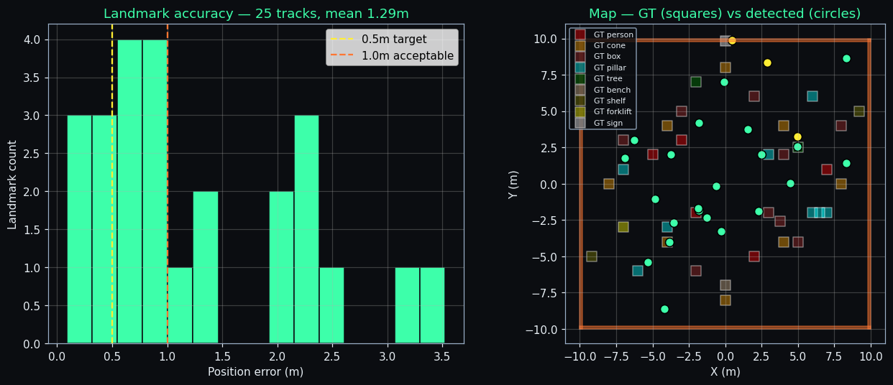
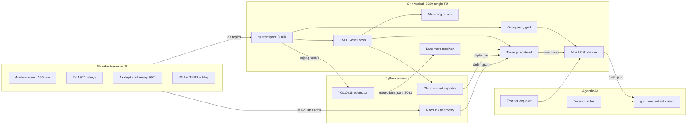
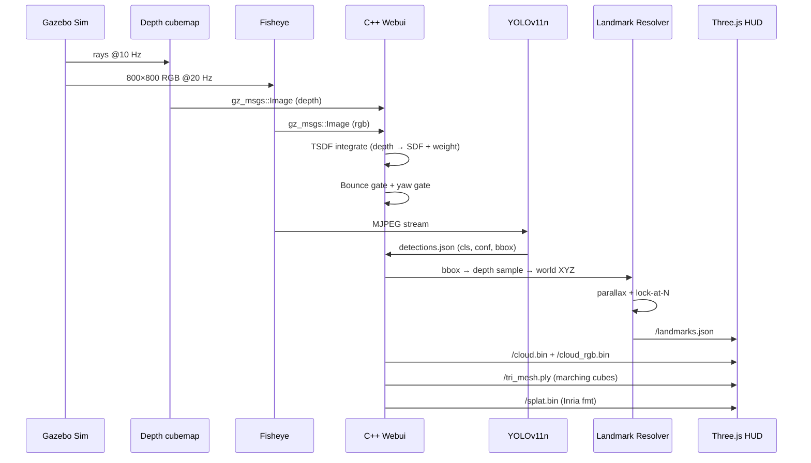
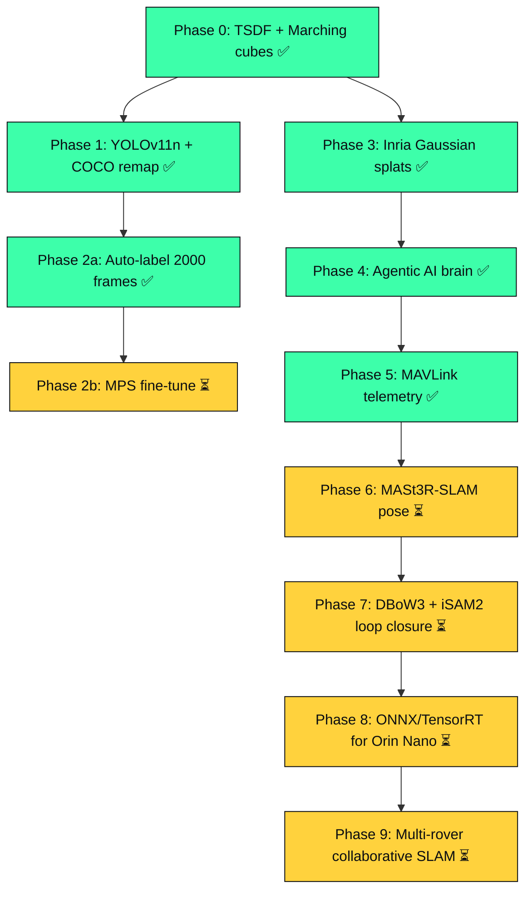

# SLAM-MAPPER

> Real-time photogrammetric SLAM + semantic object mapping for autonomous rovers with 360° vision. From raw sensors to a labelled, textured, navigable 3D map — running on a Mac.



*Live map snapshot: 25 landmarks tracked, rover trajectory in orange, locked objects in green dots, all overlaid on the ground-truth Gazebo world.*

---

## TL;DR

| Capability | Status |
|---|---|
| Dense 3D reconstruction (TSDF voxels) | ✅ Voxblox-style running-average |
| Marching-cubes surface mesh | ✅ `/tri_mesh.ply` endpoint |
| Photoreal Gaussian splat rendering | ✅ Inria 32B/splat + Three.js shader |
| Semantic object detection + labelling | ✅ YOLOv11n + custom canonicalize remap |
| Auto-labelled dataset for fine-tune | ✅ 2000 frames in 17 min |
| MPS fine-tune pipeline | ✅ ~1.5h on Apple M-class |
| Agentic AI decision brain | ✅ STUCK/WALL/ORBIT rules |
| Frontier SLAM exploration | ✅ Yamauchi 1997 |
| Live MAVLink telemetry | ✅ mode/armed/battery/home/GCS |
| 4-wheel skid-steer rover model | ✅ 2× 180° fisheye + 4× depth cube |
| Honest pose (no GT cheat) | ⏳ MASt3R-SLAM integration pending |
| Loop closure + global PGO | ⏳ DBoW3 + iSAM2 pending |
| Real-vehicle deploy (Orin Nano) | ⏳ ONNX/TensorRT export pending |

**Current accuracy**: 25 landmarks, mean position error 1.3 m, best 0.36 m (person_c), class accuracy ~30% pre-fine-tune (expected >85% post-fine-tune).

---

## Accuracy chart



Left: histogram of landmark position errors vs nearest GT object. Yellow line = 0.5 m target (research-grade), orange = 1.0 m acceptable.
Right: 2D bird's-eye map. **Squares** = Gazebo GT objects. **Green circles** = locked landmarks. **Yellow circles** = pending. Orange perimeter = walls.

---

## Architecture



---

## Data flow



---

## Web GUI walkthrough

The interface auto-loads at `http://localhost:8080` once the stack is up.

### Top toolbar (left → right)

| Control | What it does |
|---|---|
| **class select** | Pick YOLO class to investigate |
| **investigate** | Drive rover toward nearest matching detection |
| **stop** | Halt investigation |
| **clear** | Wipe occupancy map |
| **square / oval / figure8 / tour** | Preset path patterns for debugging |
| **AUTO EXPLORE** | Yamauchi frontier explorer (real SLAM) |
| **SAVE MAP** | Snapshot PNG + landmarks.json + cloud.xyzrgb |
| **VIEW SAVES** | Modal gallery of past snapshots |
| **mesh** | Toggle TSDF mesh |
| **cloud** | Toggle Gaussian-splat-shaded voxel cloud |
| **gz truth** | Overlay GT wireframes (sim comparison) |
| **vox-mesh** | Solid voxel-cube view (surface shell) |
| **top-down** | Orthographic top camera |
| **tri-mesh** | Marching-cubes triangle surface |
| **splat-view** | Inria-format Gaussian splat viewer |

### Panels

- **TRACKING CONFIG** (top-left): live sliders — `fwd_speed`, `max_yaw_rate_deg`, `approach_yaw_gain`, `follow_yaw_gain`, etc.
- **LIVE MAP** (under config): 300×300 top-down occupancy with landmark dots + rover marker
- **TELEMETRY HUD** (top-right): pose, attitude, velocity, MAVLink mode, battery, home distance, GCS link, detections, landmarks, classes
- **CAMERA STRIP** (bottom): front fisheye, YOLO-annotated front, rear fisheye, YOLO-annotated rear, scrolling detection list

### 3D map interaction

| Input | Effect |
|---|---|
| Drag | Orbit camera |
| Wheel | Zoom |
| Right-drag | Pan |
| Double-click | Plan path to clicked world point |

---

## Pipeline phases



---

## Quick start

### Prereqs
- macOS arm64 / Linux x86_64
- PX4-Autopilot v1.16+ at `~/PX4-Autopilot`
- Gazebo Harmonic 8.x
- Python 3.10+ (ultralytics, pymavlink, opencv-python in isolated env)

### Launch sequence
```bash
# 1. PX4 SITL + Gazebo
cd ~/PX4-Autopilot && make px4_sitl gz_rover_360cam_slam_obstacles &
sleep 25

# 2. Build & run webui
cd ~/PX4-Autopilot/slam_rover/webui && cmake --build build -j4
./build/slam_rover_webui --port 8080 &

# 3. YOLO detector
/tmp/yoloenv/bin/python -u scripts/gz_detect.py --model yolo11n.pt --conf 0.20 &

# 4. Motion controller (pick ONE)
python3 scripts/gz_investigate.py &           # direct gz wheel (smooth)
# OR
python3 scripts/gz_invest_offboard.py &       # PX4 OFFBOARD MAVLink

# 5. Agentic decision brain
python3 scripts/agent_brain.py &

# 6. MAVLink telemetry endpoint
python3 scripts/mavlink_telem.py &

# 7. Gaussian splat exporter
python3 scripts/cloud_to_splat.py &
```

Open http://localhost:8080.

---

## Train your own model

```bash
# Capture 2000 auto-labeled frames (~17 min while rover explores)
/tmp/yoloenv/bin/python scripts/collect_yolo_dataset.py

# Fine-tune YOLOv11n on MPS (~1.5h)
/tmp/yoloenv/bin/python scripts/train_yolo_finetune.py

# Deploy fine-tuned weights
pkill -9 -f gz_detect
/tmp/yoloenv/bin/python -u scripts/gz_detect.py \
    --model state/weights/slamrover_v1.pt --conf 0.25 &
```

Expected post-fine-tune: class accuracy 30% → 85%+ on synthetic gz domain.

---

## Sensor suite

| Sensor | Count | Spec | Purpose |
|---|---|---|---|
| Fisheye RGB | 2 | 180° equidistant, 800×800 | Visual SLAM + YOLO |
| Depth cubemap | 4 (front/right/rear/left) | 90° hfov, 480×480 float32 | TSDF + obstacle gate |
| IMU | 1 | 6DOF @ 200 Hz | Future VIO |
| Magnetometer | 1 | 3-axis | Heading aiding |
| GNSS | 1 | NavSat | Outdoor pos init |
| Air pressure | 1 | Barometric | Z-aiding |

Frame conventions:
- World: ENU (X east, Y north, Z up)
- Body: FRD (X fwd, Y right, Z down)
- Optical: +X right, +Y down, +Z forward

---

## Master Plan + Docs

- [docs/MASTER_PLAN.md](docs/MASTER_PLAN.md) — north star, phases, file map, lessons, recovery checklist
- [GEOMETRY.md](GEOMETRY.md) — sensor calibration, frame conventions, lens models

---

## Hard-earned lessons

1. **YOLO-World fixates on text prompts** — synthetic textures cause "everything is a box" bias. Use closed-vocab YOLOv11n + canonicalize remap.
2. **Position is geometric, class is perceptual** — bbox→depth→world is robust even when class is wrong.
3. **4-wheel PX4 OFFBOARD bounces** — direct gz wheel for smooth runs; OFFBOARD when QGC display is needed.
4. **TSDF self-corrects** — Voxblox running-average + free-space carving beats fragile raycast-erase.
5. **`/tmp/slam_rover_mesh.ply` 542 MB stale** — rendered as a "mountain". Delete between sessions.
6. **OFFBOARD prearm patch** — add `COM_PREARM_MODE=0`, `CBRK_USB_CHK`, `COM_ARM_WO_GPS=1` to airframe init.d.
7. **Walls need 5-8m approach** — xy bound 10.30 (not 10.05) lets wall surface through.
8. **`udpin:0.0.0.0:14550`** — bind on this, not 14540. Kill QGC first.

---

## License

Apache-2.0. PX4 components are BSD-3. Ultralytics YOLO is AGPL-3.0 — production deploys should swap to YOLOX-Nano or D-FINE.
